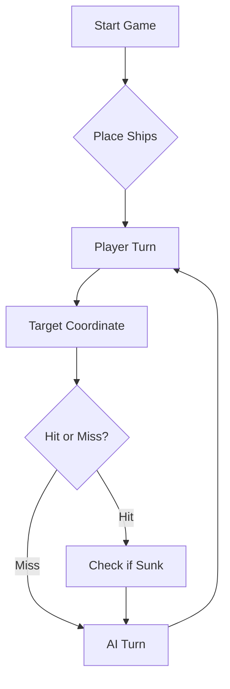

# ⚓ Battleship 2.0

> Ficha 2 demo video: [Watch on YouTube](https://youtu.be/S00AQphHRkE)


> A modern take on the classic naval warfare game, designed for the XVII century setting with updated software engineering patterns.

---

## 📖 Table of Contents
- [Project Overview](#-project-overview)
- [Key Features](#-key-features)
- [Technical Stack](#-technical-stack)
- [Installation & Setup](#-installation--setup)
- [Code Architecture](#-code-architecture)
- [Roadmap](#-roadmap)
- [Contributing](#-contributing)

---

## 🎯 Project Overview
This project serves as a template and reference for students learning **Object-Oriented Programming (OOP)** and **Software Quality**. It simulates a battleship environment where players must strategically place ships and sink the enemy fleet.

### 🎮 The Rules
The game is played on a grid (typically 10x10). The coordinate system is defined as:

$$(x, y) \in \{0, \dots, 9\} \times \{0, \dots, 9\}$$

Hits are calculated based on the intersection of the shot vector and the ship's bounding box.

### 📜 Game Commands
- `gerafrota`: Generates a random fleet of ships.
- `lefrota`: Allows you to create and load a custom fleet.
- `estado`: Shows the current status of your fleet.
- `mapa`: Displays the fleet map.
- `rajada`: Performs a burst of fire.
- `simula`: Simulates a complete game.
- `tiros`: Lists the valid shots taken (* = shot on ship, o = shot in water).
- `historico`: Displays the history of past games.
- `desisto`: Ends the game.

---

## ✨ Key Features
| Feature | Description | Status |
| :--- | :--- | :---: |
| **Grid System** | Flexible $N \times N$ board generation. | ✅ |
| **Ship Varieties** | Galleons, Frigates, and Brigantines (XVII Century theme). | ✅ |
| **AI Opponent** | Heuristic-based targeting system. | 🚧 |
| **Network Play** | Socket-based multiplayer. | ❌ |

---

## 🛠 Technical Stack
* **Language:** Java 21
* **Build Tool:** Maven / Gradle
* **Testing:** JUnit 5
* **Logging:** Log4j2

---

## 🚀 Installation & Setup

### Prerequisites
* JDK 21 or higher
* Git

### Step-by-Step
1. **Clone the repository:**
   ```bash
   git clone [https://github.com/rtz15/Battleship2.git](https://github.com/rtz15/Battleship2.git)
   ```
2. **Navigate to directory:**
   ```bash
   cd Battleship2
   ```
3. **Compile and Run:**
   ```bash
   javac Main.java && java Main
   ```

---

## 📚 Documentation

You can access the generated Javadoc here:

👉 [Battleship2 API Documentation](https://rtz15.github.io/Battleship2/)

### Core Logic
```java
public class Ship {
    private String name;
    private int size;
    private boolean isSunk;

    // TODO: Implement damage logic
    public void hit() {
        // Implementation here
    }
}
```

### Design Patterns Used:
- **Strategy Pattern:** For different AI difficulty levels.
- **Observer Pattern:** To update the UI when a ship is hit.

### Logic Flow


---

## 🗺 Roadmap
- [x] Basic grid implementation
- [x] Ship placement validation
- [ ] Add sound effects (SFX)
- [ ] Implement "Fog of War" mechanic
- [ ] **Multiplayer Integration** (High Priority)

---

## 🧪 Testing
We use high-coverage unit testing to ensure game stability. Run tests using:
```bash
mvn test
```

> [!TIP]
> Use the `-Dtest=ClassName` flag to run specific test suites during development.

## PDF Export

The simulator now exports a PDF summary to `./output/summary.pdf` when a game reaches `game over`.

Quick local checks:
```bash
mvn test
mvn -Dtest=PdfExporterTest test
mvn package
```

To generate the real PDF from the simulator:
1. Run `battleship.Main` in IntelliJ.
2. Use `gerafrota`.
3. Use `simula` and wait until all ships sink.
4. Confirm `output/summary.pdf` was created.

## Internationalized Messages

The CLI now keeps Portuguese as the default language and supports English for the main visible messages:
- startup title
- menu help
- board legend
- final goodbye and game-over text

Quick local checks:
```bash
mvn test
mvn -Dtest=LanguageSupportTest,LocalizationOutputTest test
mvn package
```

To run the game in English:
```bash
java -jar target/BattleshipGamePlayer-2.0.jar --lang en
```

You can also use the environment variable:
```bash
BATTLESHIP_LANG=en java -jar target/BattleshipGamePlayer-2.0.jar
```

## Sprint D - Estrategia do LLM

O pacote completo da parte D, preparado pelo Tiago, esta em [docs/tiago-part-d-strategy.md](docs/tiago-part-d-strategy.md).

Esta secao deve ser lida como base da parte D sobre a `main` atual, nao como fecho final do trabalho do grupo. O fecho do `README.md` deve esperar por:
- validacao manual completa da estrategia da D
- consolidacao final do texto do grupo
- registo final para demonstracao e video

Prompt de estrategia preparado:

```text
Quero que jogues como meu oponente na versao Battleship2 do jogo da Batalha Naval.

Contexto fixo do jogo:
- O tabuleiro vai de A a J nas linhas e de 1 a 10 nas colunas.
- A tua frota-alvo tem 11 navios: 4 Barcas, 3 Caravelas, 2 Naus, 1 Fragata e 1 Galeao.
- Cada jogada tua e uma rajada com exatamente 3 tiros.
- Os navios nao se tocam, nem sequer pelos cantos.

Formato da tua resposta:
- Responde sempre apenas com um array JSON valido com exatamente 3 objetos.
- Cada objeto tem exatamente as chaves "row" e "column".
- Exemplo:
[
  { "row": "A", "column": 5 },
  { "row": "C", "column": 10 },
  { "row": "F", "column": 5 }
]

Formato da minha resposta:
- Depois de cada tua rajada, eu devolvo um JSON agregado com as chaves:
  validShots, outsideShots, repeatedShots, missedShots, sunkBoats, hitsOnBoats
- Esse JSON resume a rajada inteira e nao identifica que tiro individual produziu cada efeito.

Regras obrigatorias:
- Mantem internamente um Diario de Bordo completo.
- Nunca dispares fora do tabuleiro.
- Nunca repitas tiros ja feitos, exceto na ultima jogada possivel se faltar perfazer 3 tiros.
- Se um navio for afundado, marca mentalmente todo o halo de 1 casa em volta como agua interditada.
- Se houver um acerto numa Caravela, Nau ou Fragata, as diagonais desse acerto sao agua; a excecao relevante e o corpo do Galeao por causa do T.
- Se o JSON indicar um navio afundado, para imediatamente a perseguicao desse navio.

Regra central de estrategia:
- Como a resposta e agregada, deves minimizar ambiguidade entre os 3 tiros da mesma jogada.
- Nunca mistures duas perseguicoes importantes na mesma rajada.
- Quando houver um contacto em aberto, no maximo 1 tiro da rajada pode testar diretamente uma hipotese critica desse contacto; os outros tiros devem continuar a procura noutros pontos uteis do tabuleiro, sem repetir tiros nem mirar casas ja deduzidas como agua.
- Nunca afirmes que sabes exatamente qual dos 3 tiros acertou se o JSON agregado nao o permitir.

Modo de procura:
- Usa uma malha de procura espalhada e evita agrupar os 3 tiros na mesma zona.
- Privilegia casas centrais e cobertura ampla do tabuleiro.
- Alterna o padrao para nao ficar preso a uma unica paridade, porque existem 4 Barcas.

Modo de perseguicao:
- Se surgir um contacto, reduz a ambiguidade em vez de inventar certezas.
- Em perseguicao, dedica no maximo 1 tiro a uma hipotese principal ainda nao resolvida; os outros tiros devem ser tiros de procura afastados do contacto atual, para continuares a cobrir o tabuleiro sem criar uma segunda perseguicao importante.
- Nunca uses como enchimento:
  1. casas do halo de navios ja afundados
  2. casas ja deduzidas como agua por geometria
  3. tiros repetidos, salvo a excecao de ultima jogada possivel para perfazer 3 tiros
- Se houver indicios de Galeao, testa o corpo e os bracos do T com cautela e nao assumes a regra das diagonais como absoluta.

Objetivo:
- Jogar pelo menos tao bem como um humano cuidadoso.
- Ser eficiente, conservador e coerente com a memoria.
- Continuar a responder com rajadas JSON validas ate ao fim do jogo.
```

Nota de validacao:
- Este material deixa a parte D preparada, mas nao fechada.
- A `main` atual ja imprime automaticamente na consola o JSON de resposta de `Move.processEnemyFire(...)`, por isso a validacao pratica por cut and paste ja pode ser feita.
- O texto final do `README.md` e o link do video so devem ser fechados no fim do trabalho do grupo.

---

## 🤝 Contributing
Contributions are what make the open-source community such an amazing place to learn, inspire, and create.

1. Fork the Project
2. Create your Feature Branch (`git checkout -b feature/AmazingFeature`)
3. Commit your Changes (`git commit -m 'Add some AmazingFeature'`)
4. Push to the Branch (`git push origin feature/AmazingFeature`)
5. Open a **Pull Request**

---

## 📄 License
Distributed under the MIT License. See `LICENSE` for more information.

---
**Maintained by:** [@rtz15](https://github.com/rtz15)  
*Created for the Software Engineering students at ISCTE-IUL.*
